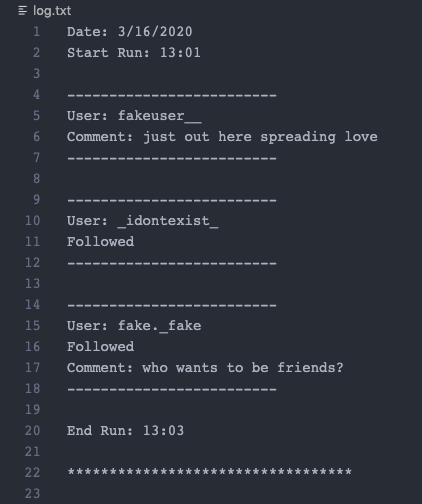

# Jarvis

## Overview:

Jarvis is a friendly bot that likes users' ig posts and leaves friendly comments on them. 
He was created using Python3 and the Selenium Webdriver API.

Jarvis has various ways of interacting with your account:

- Following users from the explore page.
- Liking and leaving a random comment on posts from the explore page.
- Liking and leaving a random comment on posts with a randomly selected hashtag.
- Liking posts from all users that you follow.
- Liking posts from a particular user.
   
  (selection of hashtags and comments are provided by the user.)

Jarvis can also be easily reprogrammed to perform other tasks on your account.

## Set up:

To use Jarvis, you will need to fork and or clone this repo, and install the following tools:

- Selenium Python package 
  `pip install selenium` 
  This will allow acces to the Selenium Webdriver API for automated interactions with the DOM.

- ChromeDriver 
  http://chromedriver.chromium.org/ 
  This will allow automated navigation capabilities in the Google Chrome web browser.

Remember to change the executable path for `self.driver` in the Jarvis `__init__` method to be the path of your own ChromeDrive executable file.

## Jarvis API:

### `__init__(self, user: str, password: str)`

Pre conditions:

- User has successfully installed Selenium and ChromeDriver

Post conditions: 
A Jarvis instance will have the following properties:

- `self.user_name` 
  User name provided.

- `self.user_password` 
  Password provided.

- `self.driver` 
  Selenium Webdriver instance that will be used for DOM interaction.

### Syntax

`jarvis_instance = Jarvis('username', 'password')`

---

### `login(self)`

Pre conditions:

- User has an active ig account.
- User provided correct user name and password combination.

Post conditions:

- Logs in to the account provided. Execution terminates once home page is reached.

### Syntax

`jarvis_instance.login()`

---

### `explore(self, tags: list, comments: list, posts: int, follow: bool)`

Pre conditions:

- Jarvis has successfully logged in to the provided account.
- `tags` (Optional - Default value: `[]`) 
  A list of strings representing possible hashtags Jarvis can visit. If empty, Jarvis will navigate to explore page
- `comments` (Optional - Default value: `[]`) 
  A list of strings representing possible comments Jarvis can make on a particular post.
  Jarvis will not comment if list of comments is empty.
- `posts` (Optional - Default value: `20`) 
  An integer denoting how many posts Jarvis should go through.
- `follow` (Optional - Default value: `False`) 
  A boolean (or any other truthy or falsy value) denoting whether Jarvis should follow users as he likes and comments on their post or not.

Post conditions:

- Jarvis will go through the specified amount of posts, from either the explore page or hashtags page and like every single post. Jarvis will leave a randomly selected comment on approximately 75% of those posts, if comments are provided. There is also approximately a 60% chance that Jarvis will follow the user of that particular post if `follow` is set to `True`. 
  As Jarvis goes through each post, he will collect the username of the person who made the post and save it in a file called `log.txt`. Jarvis will also make a note if a comment was made and if the user was followed. 
   
  `log.txt` example: 
  

### Syntax

`jarvis_instance.explore()` or ... 
`jarvis_instance.explore(['sports', 'nature', 'photography'], ['nice!', 'awesome!', 'wow'], 50, True)` or ... 
`jarvis_instance.explore([], [], 50, True)` or ... 
`jarvis_instance.explore(['photography'], [], 50, True)`

---

### `show_love(self, posts: int, user: str)`

Pre conditions:

- Jarvis has successfully logged in to the provided account.
- `posts` (Optional - Default value: `20`) 
  An integer denoting how many posts in the feed Jarvis should go through.
- `user` (Optional - Default value: `None`) 
  A string that denotes whether Jarvis should show love to all users in feed, or just the user provided. If a user is provided, Jarvis will navigate to that particular user's profile.

Post conditions:

- Jarvis will go through the specified amount of posts in your feed, liking approximately 60% of them.
  The rest will be skipped as Jarvis scrolls past them. If a user is provided, Jarvis will navigate to their profile and go through the specified amount of posts, liking all unliked posts he comes across.

### Syntax

`jarvis_instance.show_love()` or ... 
`jarvis_instance.show_love(50, 'your_bff_user_name')`

---
